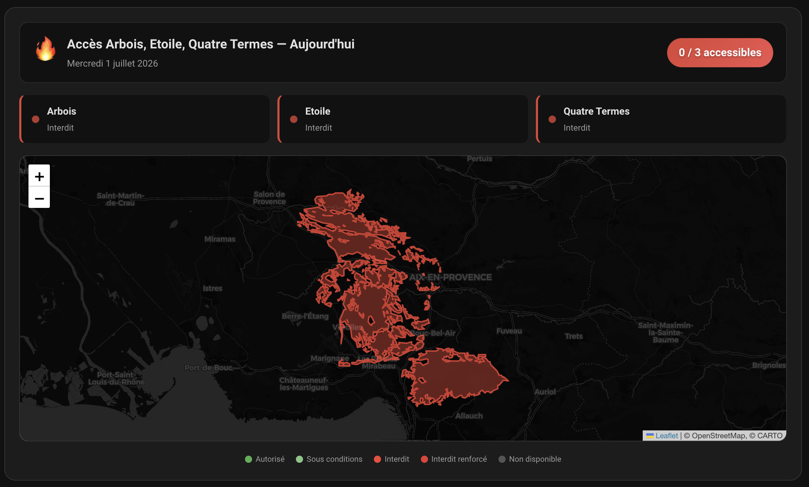
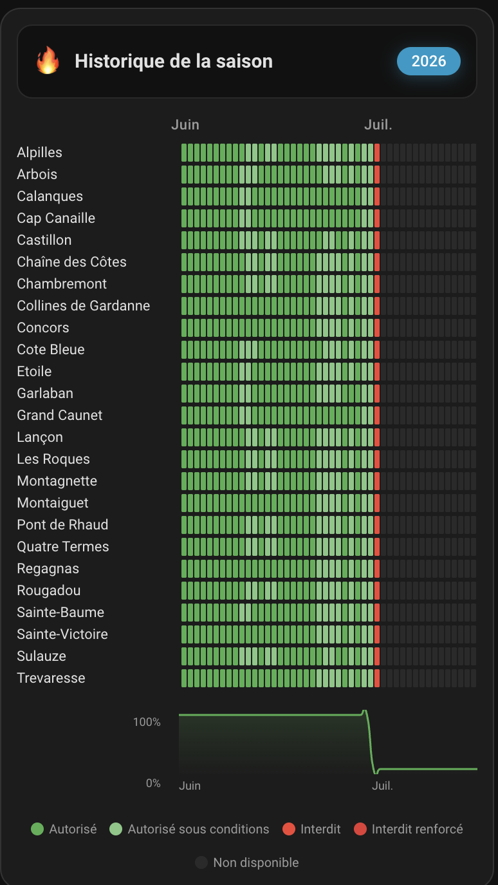

# 🌲🔥 Accès Massifs Forestiers 13

[](https://hacs.xyz)
[](https://www.home-assistant.io)
[](https://github.com/acces-massifs-13-ha)

Intégration Home Assistant personnalisée et haut de gamme pour récupérer automatiquement les **niveaux d'accès aux 25 massifs forestiers des Bouches-du-Rhône** depuis le site officiel de la Préfecture : [risque-prevention-incendie.fr/13](https://www.risque-prevention-incendie.fr/13).

---

## ✨ Fonctionnalités majeures

*   📊 **25 Capteurs massifs** — Un capteur dédié par massif forestier avec son statut d'accès en temps réel.
*   👑 **Capteur Résumé Global** (`sensor.acces_massifs_13_summary`) — Centralise toutes les statistiques du jour, l'historique complet et la configuration.
*   ⏰ **Configuration dynamique de la planification** — Une entité native Home Assistant `time` (**Heure de récupération**) permet d'ajuster dynamiquement et directement depuis l'interface l'heure exacte du scan quotidien.
*   🗓️ **Mode d'affichage temporel intelligent** — Les cartes adaptent automatiquement leur état : elles affichent les données d'**aujourd'hui** en journée, puis basculent sur les prévisions de **demain** dès que la mise à jour préfectorale de fin de journée est publiée !
*   ❄️ **Gestion logique hors-saison (1er oct. – 31 mai)** :
    *   L'intégration bascule automatiquement tous les massifs à l'état **"Autorisé" (vert, niveau 1)** pour refléter l'accès libre hivernal et printanier, assurant la cohérence de vos automatisations toute l'année.
    *   Le rythme de polling API passe de **1 heure** (en saison) à **6 heures** (hors-saison) pour optimiser les performances de Home Assistant.
    *   La carte de cartographie affiche un élégant bandeau informatif bleu à effet glassmorphism arborant un flocon de neige (`❄️`) animé en rotation lente.
*   📭 **Robustesse & Tolérance aux pannes** — Gestion intelligente des erreurs HTTP 404 (données non encore publiées sur le site officiel) pour éviter de polluer vos journaux Home Assistant avec des erreurs ou tracebacks inutiles.
*   📈 **Historique persistant multi-saisons** — Stockage JSON local autonome dans le dossier `.storage/` pour sauvegarder et afficher l'historique complet sur plusieurs années, indépendamment de la purge du recorder HA.
*   🎨 **Deux cartes Lovelace premium** — Design sombre glassmorphism ultra-léché avec animations fluides d'entrée, effets de surbrillance au survol et adaptation naturelle à vos thèmes Home Assistant (clair/sombre).
*   🗺️ **Cartographie vectorielle interactive** — Rendu Leaflet local (sans CDN) dessinant les frontières réelles des massifs en vert/rouge (polygones GeoJSON interactifs) avec popups de restriction au clic.
*   ⚡ **Intégration Lovelace transparente (Zéro-Configuration)** — Enregistrement automatique des cartes custom dans le registre des ressources de Home Assistant dès l'installation, avec un système de **cache-busting intelligent** (`?v=1.0.8`) lié au fichier `manifest.json` pour garantir que les mises à jour s'affichent instantanément sans forcer le vidage du cache du navigateur !
*   ⚙️ **Éditeurs Visuels Natifs (UI Editors)** — Les deux cartes custom se configurent entièrement en mode graphique dans l'interface de Home Assistant (sélection d'entités, commutateurs, menus déroulants, champs texte), sans aucun code YAML requis !
*   🎯 **Intégration visuelle locale (Branding)** — Inclut des icônes et logos locaux transparents (thèmes clairs et sombres) pour un rendu impeccable dans la liste des intégrations de Home Assistant.

---

## 🚀 Installation

### Via HACS (Recommandé)

1.  Ouvrez **HACS** dans votre interface Home Assistant.
2.  Cliquez sur **Intégrations**.
3.  Cliquez sur les **⋮** en haut à droite ➔ **Dépôts personnalisés**.
4.  Ajoutez l'URL de ce dépôt Git et sélectionnez **Intégration** comme catégorie.
5.  Recherchez **Accès Massifs Forestiers 13** et cliquez sur **Télécharger**.
6.  **Redémarrez Home Assistant** pour charger l'intégration, son icône locale et ses ressources Lovelace.

### Installation manuelle

1.  Téléchargez ce dépôt.
2.  Copiez le dossier `custom_components/acces_massifs_13/` dans le répertoire `config/custom_components/` de votre Home Assistant.
3.  **Redémarrez Home Assistant**.

---

## ⚙️ Configuration Backend

L'intégration se configure très simplement via l'interface utilisateur de Home Assistant :
1.  Allez dans **Paramètres ➔ Appareils & Services ➔ Ajouter une intégration**.
2.  Recherchez **Accès Massifs Forestiers 13**.
3.  Définissez l'heure et la minute souhaitées pour la récupération quotidienne des données (ex. `18`h`30`).
4.  *Optionnel* : Vous pouvez modifier cette planification à tout moment en cliquant sur **Options** sur la carte de l'intégration, ou plus simplement en modifiant directement la valeur de l'entité native `time` créée (voir ci-dessous).

---

## 📊 Entités et Attributs créés

L'intégration crée un ensemble complet d'entités regroupées sous un appareil unique **Accès Massifs Forestiers 13**.

### Capteur Résumé Global (`sensor.acces_massifs_13_summary`)

*   `state` : Nombre de massifs forestiers interdits aujourd'hui.
*   **Attributs complets** :
    *   `total_massifs` : Nombre total de massifs surveillés (25).
    *   `accessible_count` : Nombre de massifs accessibles.
    *   `forbidden_count` : Nombre de massifs interdits d'accès.
    *   `unknown_count` : Nombre de massifs avec état inconnu.
    *   `is_season` : Indique si la surveillance active (saison estivale) est en cours.
    *   `today_date` : Date du jour au format `YYYYMMDD`.
    *   `tomorrow_date` : Date du lendemain au format `YYYYMMDD`.
    *   `scan_hour` / `scan_minute` : Heure planifiée du scan quotidien.
    *   `massifs` : Dictionnaire complet structuré contenant l'état d'accès de tous les massifs.
    *   `history` : Dictionnaire d'historique persistant pour la carte historique.

### Capteurs individuels (×25)

Chaque massif (ex. `sensor.acces_massif_calanques`) possède l'état principal suivant :
*   `state` : **"Autorisé"** (vert, niveau 1-2), **"Interdit"** (rouge, niveau 3-4) ou **"Non disponible"** (niveau 0).

**Attributs détaillés :**
*   `massif_id` : Identifiant unique interne du massif.
*   `massif_name` : Nom lisible du massif.
*   `level` : Niveau d'accès numérique du jour (0 à 4).
*   `color` : Code couleur associé ("green", "red", "unknown").
*   `procedure` : Code de procédure administrative (0 ou 1).
*   `tomorrow_level` : Niveau d'accès prévu pour demain (0 à 4).
*   `tomorrow_color` : Couleur prévue pour demain.
*   `tomorrow_label` : Label d'accès prévu pour demain.
*   `latitude` / `longitude` : Coordonnées GPS centrales du massif forestier.
*   `is_season` : Indique si la saison active est en cours (booléen).

### Entité de contrôle horaire (`time.acces_massifs_forestiers_13_heure_de_recuperation`)

*   `state` : Heure configurée pour la synchronisation quotidienne (ex: `18:30:00`).
*   **Fonctionnement** : Vous pouvez modifier cet horaire directement depuis vos dashboards Lovelace ou via des automatisations. L'intégration mettra à jour sa planification interne instantanément et à chaud.

---

## 🔔 Paliers de Risques Officiels (Préfecture)

| Niveau | Couleur | Label | Signification |
| :--- | :---: | :--- | :--- |
| **0** | ⬜ Blanc | Non disponible | Hors saison active / Pas de données |
| **1** | 🟢 Vert | Autorisé | Accès autorisé toute la journée |
| **2** | 🟢 Vert | Autorisé | Accès autorisé (avec conditions d'horaires ou de travaux) |
| **3** | 🔴 Rouge | Interdit | Accès et présence strictement interdits toute la journée |
| **4** | 🔴 Rouge | Interdit | Accès et présence strictement interdits (fermeture renforcée) |

---

## 🎨 Cartes Lovelace Custom

Les deux cartes se configurent directement via l'**éditeur visuel graphique** de votre dashboard. Aucun code YAML n'est nécessaire, mais les configurations ci-dessous sont fournies pour un usage avancé.

### 1. Carte Accès & Cartographie (`acces-massifs-forecast-card`)

Affiche l'état d'accès de vos massifs forestiers sous forme de grille adaptative animée avec pulsation, couplée à une carte Leaflet interactive dessinant les polygones réels de vos massifs.



> [!TIP]
> **Support Multi-Massifs & Centrage Intelligent** : Vous pouvez désormais cibler un sous-ensemble de massifs en fournissant une liste d'entités. La carte s'adaptera automatiquement et ajustera son zoom pour se centrer exclusivement sur les zones sélectionnées !

```yaml
type: custom:acces-massifs-forecast-card
entity: sensor.acces_massifs_13_summary  # Optionnel si 'entities' est défini
entities:                               # Pour n'afficher et ne cartographier qu'une sélection
  - sensor.acces_massif_calanques
  - sensor.acces_massif_sainte_victoire
  - sensor.acces_massif_alpilles
title: "Mes massifs favoris"            # Optionnel (génère un titre automatique si omis)
show_map: true
map_height: 400
animate: true
mode: auto
```

**Options de configuration de la carte :**
*   `entity` *(Optionnel si `entities` est renseigné)* : L'entité de résumé (`sensor.acces_massifs_13_summary`) ou un capteur de massif individuel.
*   `entities` *(Optionnel)* : Une liste d'entités de capteurs (individuels ou résumé global). Permet de restreindre l'affichage et la cartographie à un groupe de massifs favoris.
*   `title` *(Optionnel)* : Titre de la carte. Si omis et qu'un groupe de massifs ou un massif individuel est ciblé, la carte génère automatiquement un titre décrivant les massifs surveillés (ex: *"Accès Calanques, Sainte-Victoire — Aujourd'hui"*).
*   `show_map` *(Optionnel)* : `true` (défaut) pour afficher la carte interactive, `false` pour la masquer.
*   `map_height` *(Optionnel)* : Hauteur en pixels de la carte Leaflet (par défaut `400`).
*   `animate` *(Optionnel)* : `true` (défaut) pour activer l'apparition progressive des éléments et les pulsations.
*   `mode` *(Optionnel)* :
    *   `auto` *(Défaut, intelligent)* : Affiche les statuts de la journée en cours (*Aujourd'hui*) puis bascule automatiquement sur les prévisions du lendemain (*Demain*) dès que le scan quotidien a eu lieu.
    *   `today` : Force l'affichage permanent de l'accès pour la journée en cours.
    *   `tomorrow` : Force l'affichage permanent des prévisions du lendemain.

---

### 2. Carte Historique (`acces-massifs-history-card`)

Affiche une matrice heatmap animée (jours en abscisse, massifs en ordonnée) retraçant l'ensemble des niveaux d'accès sur toute la saison (juin à septembre). Comprend des tooltips détaillés au survol, un focus par clic sur une ligne et une sparkline SVG fluide en bas de carte affichant la tendance d'ouverture des massifs.



```yaml
type: custom:acces-massifs-history-card
entity: sensor.acces_massifs_13_summary
title: "Historique de la saison"
year: 2026
animate: true
show_sparkline: true
```

**Options de la carte :**
*   `entity` *(Requis)* : L'entité de résumé (`sensor.acces_massifs_13_summary`).
*   `title` *(Optionnel)* : Titre de la carte.
*   `year` *(Optionnel)* : Année affichée par défaut (par défaut, l'année en cours).
*   `animate` *(Optionnel)* : `true` (défaut) pour animer le tracé de la sparkline et l'apparition progressive des cellules.
*   `show_sparkline` *(Optionnel)* : `true` (défaut) pour afficher la courbe de tendance globale en bas de carte.

---

## 🌲 Les 25 Massifs surveillés

Alpilles · Arbois · Calanques · Cap Canaille · Castillon · Chaîne des Côtes · Chambremont · Collines de Gardanne · Concors · Cote Bleue · Etoile · Garlaban · Grand Caunet · Lançon · Les Roques · Montagnette · Montaiguet · Pont de Rhaud · Quatre Termes · Regagnas · Rougadou · Sainte-Baume · Sainte-Victoire · Sulauze · Trevaresse

---

## 📝 Exemple d'automatisation de notification

Vous pouvez facilement créer des automatisations pour être prévenu sur votre smartphone si votre massif favori passe en rouge pour le lendemain :

```yaml
alias: "Alerte Calanques Interdites pour demain"
description: "Envoie une notification si les Calanques sont interdites d'accès pour demain"
trigger:
  - platform: state
    entity_id: sensor.acces_massifs_13_summary
condition: []
action:
  - choose:
      - conditions:
          - condition: template
            value_template: >-
              {{ state_attr('sensor.acces_massif_calanques', 'tomorrow_color') == 'red' }}
        sequence:
          - service: notify.mobile_app_votre_smartphone
            data:
              title: "🔴 Calanques interdites demain"
              message: >-
                Attention, l'accès au massif des Calanques sera interdit demain pour risque incendie exceptionnel !
mode: single
```

---

## 📜 Licences et Crédits

*   **Source des données** : Données publiques fournies par la Préfecture des Bouches-du-Rhône.
*   **Licence** : Ce projet est distribué sous licence MIT.
